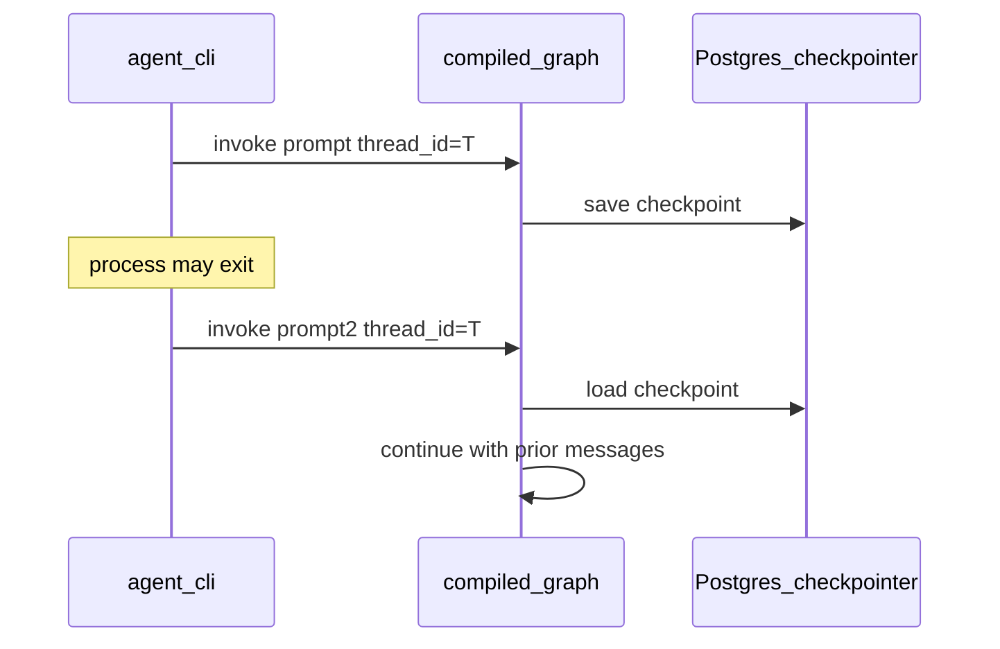
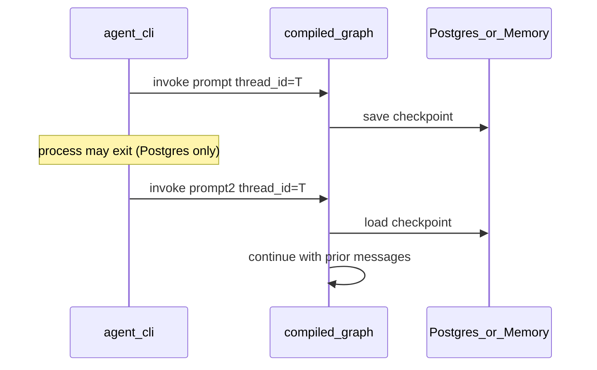

# Milestone 5: Postgres checkpointer & session resume

## Status

Done

## Goal

Persist ReAct graph state with a **Postgres-backed LangGraph checkpointer** so the same `thread_id` can continue across process restarts — turning one-shot `agent.sh` invokes into real **sessions** (still CLI; optional tiny REPL for demo).

## Why this milestone (learning objectives)

- M2’s optional `MemorySaver` dies with the process. Claude Code–style conversation needs **durable** thread state.
- Checkpointer is *why* we used a StateGraph: pause/resume, later interrupt (M10), and multi-turn all attach here — not to a hand-rolled `while` + DIY DB.
- Contrast **MemorySaver vs Postgres**: same graph API, different durability guarantees.

## Concepts introduced

- **Checkpointer:** stores graph checkpoints (messages + channel versions) keyed by `thread_id`.
- **`configurable.thread_id`:** session id passed in `invoke`/`stream` config.
- **Resume:** next `invoke` with the same `thread_id` loads prior messages automatically.
- **Simplification:** one DB from M0 Compose; no multi-tenant auth; CLI may pass `--thread-id` or start a short REPL.

## Design decisions & alternatives considered

| Decision | Choice | Alternatives rejected |
|---|---|---|
| Store | LangGraph Postgres checkpointer against existing `DATABASE_URL` | Redis / sqlite-only (less aligned with M0 infra) |
| Keep MemorySaver | Optional flag for offline unit tests | Delete MemorySaver entirely |
| CLI UX | `--thread-id` required for durable mode + optional `--repl` loop | Full TUI (later / M6 streaming) |
| Schema setup | Document/setup helper to ensure checkpoint tables exist | Manual SQL only |

**Simplification:** no encryption at rest, no thread listing UI, no TTL GC. Production adds tenancy, retention, and access control.

## Architecture graph (planned)




Topology of nodes/edges **unchanged**; durability is compile-time `checkpointer=...`.

## Testing (planned)

### Unit

- [x] Graph compiled with a checkpointer interface (MemorySaver ok) resumes second turn in-process with fake LLM (messages accumulate)
- [x] Helper builds/returns Postgres checkpointer from `DATABASE_URL` (mock or skip if import wiring only)

### Integration

- [x] Against Compose Postgres: two `invoke`s with same `thread_id` in separate compiled graphs/processes see prior Human/AI messages (skip if Postgres down)
- [x] Different `thread_id`s do not share history (skip if Postgres down)

## Tasks

- [x] Add checkpointer factory module (`get_checkpointer(settings)` → MemorySaver | Postgres)
- [x] Wire `build_agent_graph` / CLI: durable mode uses Postgres when available
- [x] CLI: emphasize `--thread-id`; add minimal `--repl` for multi-turn demo
- [x] `setup.sh` or docs: ensure checkpoint migrations/tables
- [x] Unit + integration tests
- [x] Results + LEARNING_LOG + architecture; commit + push

## Demo / acceptance criteria

1. Terminal A: `./scripts/agent.sh --thread-id demo-1 "Remember the codeword ORANGE."` (or REPL equivalent).
2. New process: `./scripts/agent.sh --thread-id demo-1 "What codeword did I tell you?"` recalls ORANGE (model-dependent but state must include prior messages).
3. Unit tests green without Postgres; integration skips cleanly if DB down.
4. Docs contrast MemorySaver vs Postgres.

## Results

### What we did

- Added `agent/checkpointer.py`: `open_checkpointer` context manager for `memory` | `postgres` (`CHECKPOINT_BACKEND`), plus `ensure_postgres_checkpoint_tables()` for bootstrap.
- CLI: `--thread-id` / `--new-thread` open a checkpointer (default Postgres); `--checkpointer memory|postgres` override; `--repl` multi-turn loop.
- `setup.sh` idempotently runs checkpoint table setup after Compose is healthy.
- Unit + integration tests for MemorySaver resume and Postgres cross-connection resume / thread isolation.

### Commands & how to reproduce

```bash
# Unit (no Postgres required)
./scripts/test.sh tests/unit/test_m5_checkpointer.py -v

# Integration (Compose Postgres)
./scripts/test.sh tests/integration/test_m5_checkpointer_live.py -v

# Durable session demo (two processes, same thread_id)
./scripts/agent.sh --thread-id demo-1 "Remember the codeword ORANGE."
./scripts/agent.sh --thread-id demo-1 "What codeword did I tell you?"

# Offline / process-local only
./scripts/agent.sh --checkpointer memory --thread-id local-1 "hi"

# REPL
./scripts/agent.sh --repl --thread-id demo-repl
```

### As-built graph




- Delta vs planned graph: topology unchanged. Session path matches plan; MemorySaver remains for unit tests / `--checkpointer memory`.

### Why this approach

- Same `compile(checkpointer=...)` + `configurable.thread_id` API for both backends — durability is a storage concern, not a new graph shape.
- Holding `PostgresSaver.from_conn_string` open for the whole invoke/REPL is required (context manager owns the connection).
- Without a durable checkpointer: every `agent.sh` process is amnesiac; HITL/interrupt later has nowhere to pause.

### Deviations from plan

- Factory is `open_checkpointer` (context manager) rather than a bare `get_checkpointer()` return — Postgres needs a live connection for the session lifetime.
- One-shot invokes without `--thread-id` still run with `checkpointer=None` (no session), matching casual demos.

### Pitfalls & aha moments

- `MemorySaver` and `PostgresSaver` look identical at the graph API; the only durable difference is process death.
- `setup()` is idempotent but must run once against Compose before first durable invoke (now in `setup.sh`).

### Testing results

- Unit: 3 passed (`test_m5_checkpointer.py`) — MemorySaver resume, backend resolve, memory open.
- Integration: 2 passed (`test_m5_checkpointer_live.py`) against local Compose Postgres — cross-connection resume + thread isolation.

### Open questions / next dig

- M6: streaming CLI / token events on top of the same checkpointer sessions.
- Later: thread listing, TTL GC, tenancy (out of learning scope).
