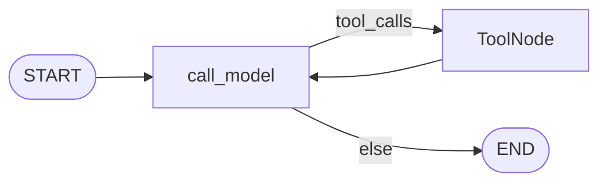
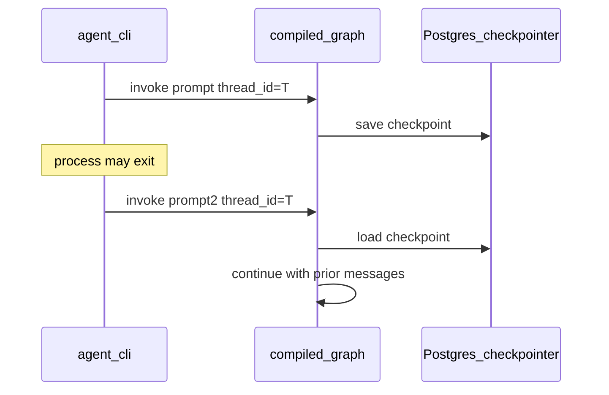

# Milestone 5: Postgres checkpointer & session resume

## Status

Planned

## Goal

Persist ReAct graph state with a **Postgres-backed LangGraph checkpointer** so the same `thread_id` can continue across process restarts — turning one-shot `agent.sh` invokes into real **sessions** (still CLI; optional tiny REPL for demo).

## Why this milestone (learning objectives)

- M2’s optional `MemorySaver` dies with the process. Claude Code–style conversation needs **durable** thread state.
- Checkpointer is *why* we used a StateGraph: pause/resume, later interrupt (M10), and multi-turn all attach here — not to a hand-rolled `while` + DIY DB.
- Contrast **MemorySaver vs Postgres**: same graph API, different durability guarantees.

## Concepts introduced

- **Checkpointer:** stores graph checkpoints (messages + channel versions) keyed by `thread_id`.
- **`configurable.thread_id`:** session id passed in `invoke`/`stream` config.
- **Resume:** next `invoke` with the same `thread_id` loads prior messages automatically.
- **Simplification:** one DB from M0 Compose; no multi-tenant auth; CLI may pass `--thread-id` or start a short REPL.

## Design decisions & alternatives considered

| Decision | Choice | Alternatives rejected |
|---|---|---|
| Store | LangGraph Postgres checkpointer against existing `DATABASE_URL` | Redis / sqlite-only (less aligned with M0 infra) |
| Keep MemorySaver | Optional flag for offline unit tests | Delete MemorySaver entirely |
| CLI UX | `--thread-id` required for durable mode + optional `--repl` loop | Full TUI (later / M6 streaming) |
| Schema setup | Document/setup helper to ensure checkpoint tables exist | Manual SQL only |

**Simplification:** no encryption at rest, no thread listing UI, no TTL GC. Production adds tenancy, retention, and access control.

## Architecture graph (planned)





Topology of nodes/edges **unchanged**; durability is compile-time `checkpointer=...`.

## Testing (planned)

### Unit

- [ ] Graph compiled with a checkpointer interface (MemorySaver ok) resumes second turn in-process with fake LLM (messages accumulate)
- [ ] Helper builds/returns Postgres checkpointer from `DATABASE_URL` (mock or skip if import wiring only)

### Integration

- [ ] Against Compose Postgres: two `invoke`s with same `thread_id` in separate compiled graphs/processes see prior Human/AI messages (skip if Postgres down)
- [ ] Different `thread_id`s do not share history (skip if Postgres down)

## Tasks

- [ ] Add checkpointer factory module (`get_checkpointer(settings)` → MemorySaver | Postgres)
- [ ] Wire `build_agent_graph` / CLI: durable mode uses Postgres when available
- [ ] CLI: emphasize `--thread-id`; add minimal `--repl` for multi-turn demo
- [ ] `setup.sh` or docs: ensure checkpoint migrations/tables
- [ ] Unit + integration tests
- [ ] Results + LEARNING_LOG + architecture; commit + push

## Demo / acceptance criteria

1. Terminal A: `./scripts/agent.sh --thread-id demo-1 "Remember the codeword ORANGE."` (or REPL equivalent).
2. New process: `./scripts/agent.sh --thread-id demo-1 "What codeword did I tell you?"` recalls ORANGE (model-dependent but state must include prior messages).
3. Unit tests green without Postgres; integration skips cleanly if DB down.
4. Docs contrast MemorySaver vs Postgres.

## Results

*(Fill after implementation.)*

### What we did

### Commands & how to reproduce

### As-built graph

```mermaid
%% fill after implementation
```

- Delta vs planned graph:

### Why this approach

### Deviations from plan

### Pitfalls & aha moments

### Testing results

### Open questions / next dig
