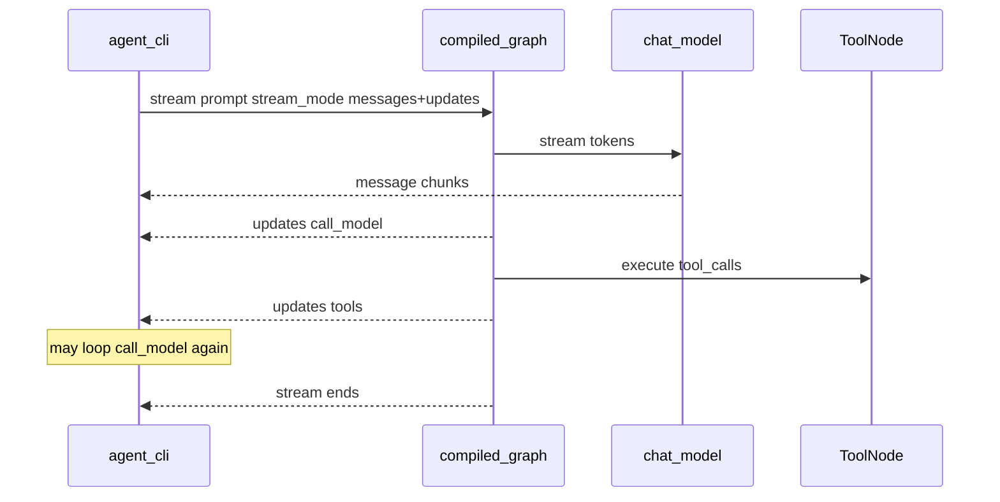

# Milestone 6: Streaming CLI

## Status

Planned

## Goal

Replace the CLI’s “wait then dump full transcript” UX with **LangGraph streaming**: token-level assistant text plus **tool/node lifecycle events**, on top of the same ReAct graph and optional Postgres `thread_id` sessions (M5). Frontend remains deferred.

## Why this milestone (learning objectives)

- Claude Code–style agents feel interactive because users see **tokens and tool activity as they happen** — not because the graph topology changed.
- Streaming attaches to the **compiled graph runtime** (`graph.stream` / `astream`), same attachment point as checkpointer and (later) interrupt — another reason we did not invent a hand-rolled `while` loop in M2.
- Critical pitfall: `stream_mode="messages"` only yields tokens if the **LLM call inside `call_model` actually streams**. A node that uses `model.invoke()` will still finish as one chunk.

### Why bother — with vs without streaming

Streaming does **not** make the agent smarter, give it new tools, or change ReAct correctness. Final state after a successful run should match `invoke`. What changes is **when** information reaches the human (and later: UI, Slack/Discord, HITL).

| Concern | Without streaming (`invoke` only) | With streaming (`stream` + token LLM) |
|---|---|---|
| Latency feel | Long silent wait, then a wall of text | First tokens appear early; wait feels shorter even if wall-clock is similar |
| Debuggability mid-run | Blind until the whole turn finishes | See which node/tool ran (`updates`) while still executing |
| Failure UX | Crash/timeout after N seconds of silence — unclear where it stuck | Last visible event often shows “stuck in tools / waiting on model” |
| HITL / later channels (M10, M18) | Harder to show “about to run shell” before the fact | Same event stream can drive CLI, web SSE, or Discord progress messages |
| Learning LangGraph | Easy to think “agent = invoke black box” | Forces owning runtime events: tokens ≠ tool progress ≠ checkpoints |

**Necessity for this learning repo:** not strictly required for a correct toy agent — M2–M5 already prove the loop and durable sessions. It **is** necessary if the goal is to understand how production coding agents *feel* and how UIs/bots stay responsive. Without M6 you can still build agents; you will systematically under-appreciate the graph runtime and over-build “print after done” CLIs that do not transfer to real products.

**What we keep:** `--no-stream` remains so you can A/B the same prompt and prove the cognitive difference yourself.

## Concepts introduced

- **`graph.stream` / `astream`:** push graph events while the run is in progress.
- **`stream_mode`:**
  - `messages` — LLM token chunks `(message_chunk, metadata)` from nodes that stream the model
  - `updates` — per-node state deltas (e.g. `call_model` finished, `tools` finished) for tool/lifecycle UX
- **Token vs event streaming:** tokens = model I/O; updates/custom = control-plane progress (tools are silent under `messages` alone).
- **Simplification:** no WebSocket/SSE UI; no Rich TUI framework; no `custom` stream writer inside every tool yet (can note as follow-up). CLI stdout only.

## Design decisions & alternatives considered

| Decision | Choice | Alternatives rejected |
|---|---|---|
| Modes for CLI | `["messages", "updates"]` together | `values` only (too heavy / late); `debug` (noisy for demos) |
| LLM path | `call_model` uses `model.stream(...)` (sync) and accumulates into one `AIMessage` for state | Keep `invoke` and only stream node boundaries (misses token UX) |
| Default UX | Streaming on by default; `--no-stream` keeps M5-style `invoke` + final transcript | Streaming opt-in only |
| Sessions | Unchanged: `--thread-id` + checkpointer still work with `stream` | Separate “stream-only” graph |
| Frontend | Still deferred | React/SSE now (premature for learning) |
| Tool progress | Rely on `updates` when `ToolNode` completes; optional one demo `custom` emit later | Instrument every FS/shell tool with `get_stream_writer` in M6 |

**Simplification:** do not guarantee token streaming for every provider quirk; Ollama is the live integration target. Cloud providers skip without keys. Partial tool-call JSON streaming is best-effort.

## Architecture graph (planned)




Topology of nodes/edges **unchanged**; streaming is runtime API + how `call_model` invokes the LLM.

## Testing (planned)

### Unit

- [ ] Fake streaming LLM: `call_model` / graph `stream` with `stream_mode="messages"` yields multiple content chunks that concatenate to the final answer (no network)
- [ ] With fake LLM that returns tool_calls then a final text turn: `stream_mode="updates"` (or combined modes) surfaces a `tools` update and message/tool ordering stays coherent
- [ ] `--no-stream` / invoke path still returns a full messages list (regression smoke via helper, not full CLI subprocess required)

### Integration

- [ ] Live Ollama (or configured provider): `stream` prints progressive content; skip if provider down
- [ ] Same `thread_id` + Postgres checkpointer: streamed turn 2 still resumes prior messages (skip if Postgres down)

## Tasks

- [ ] Teach `call_model` to stream the bound model and append a complete `AIMessage` to state
- [ ] CLI: stream consumer that prints tokens live and labels tool/node updates; keep `--no-stream`
- [ ] Preserve REPL + checkpointer behavior under streaming
- [ ] Unit + integration tests
- [ ] Results + LEARNING_LOG + architecture; commit + push

## Demo / acceptance criteria

1. `./scripts/agent.sh "Say hello in one short sentence."` shows tokens appearing before the run ends (not only a final dump).
2. A tool-using prompt shows a visible tools/lifecycle cue (from `updates`) then continued model tokens.
3. `./scripts/agent.sh --no-stream "..."` still works like M5 (final transcript).
4. With `--thread-id`, streaming turns still accumulate in Postgres (verify via resume or `db-inspect`).
5. Unit tests green offline; integration skips cleanly without Ollama/Postgres.

## Results

*(Fill after implementation.)*

### What we did

### Commands & how to reproduce

### As-built graph

```mermaid
%% fill after implementation
```

- Delta vs planned graph:

### Why this approach

### Deviations from plan

### Pitfalls & aha moments

### Testing results

### Open questions / next dig
