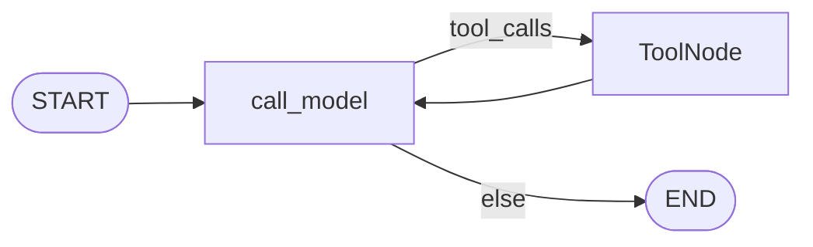
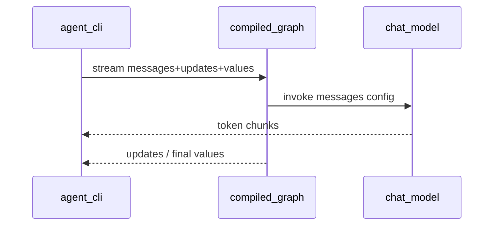

# Milestone 6: Streaming CLI

## Status

Done

## Goal

Replace the CLI’s “wait then dump full transcript” UX with **LangGraph streaming**: token-level assistant text plus **tool/node lifecycle events**, on top of the same ReAct graph and optional Postgres `thread_id` sessions (M5). Frontend remains deferred.

## Why this milestone (learning objectives)

- Claude Code–style agents feel interactive because users see **tokens and tool activity as they happen** — not because the graph topology changed.
- Streaming attaches to the **compiled graph runtime** (`graph.stream` / `astream`), same attachment point as checkpointer and (later) interrupt — another reason we did not invent a hand-rolled `while` loop in M2.
- Critical pitfall: `stream_mode="messages"` only yields tokens if the LLM run inside `call_model` participates in LangChain callbacks — typically by passing **`config` into `model.invoke(..., config)`**. A bare `model.invoke(messages)` without config (or a non-`BaseChatModel` fake) will not stream tokens.

### Why bother — with vs without streaming

Streaming does **not** make the agent smarter, give it new tools, or change ReAct correctness. Final state after a successful run should match `invoke`. What changes is **when** information reaches the human (and later: UI, Slack/Discord, HITL).

| Concern | Without streaming (`invoke` only) | With streaming (`stream` + token LLM) |
|---|---|---|
| Latency feel | Long silent wait, then a wall of text | First tokens appear early; wait feels shorter even if wall-clock is similar |
| Debuggability mid-run | Blind until the whole turn finishes | See which node/tool ran (`updates`) while still executing |
| Failure UX | Crash/timeout after N seconds of silence — unclear where it stuck | Last visible event often shows “stuck in tools / waiting on model” |
| HITL / later channels (M10, M18) | Harder to show “about to run shell” before the fact | Same event stream can drive CLI, web SSE, or Discord progress messages |
| Learning LangGraph | Easy to think “agent = invoke black box” | Forces owning runtime events: tokens ≠ tool progress ≠ checkpoints |

**Necessity for this learning repo:** not strictly required for a correct toy agent — M2–M5 already prove the loop and durable sessions. It **is** necessary if the goal is to understand how production coding agents *feel* and how UIs/bots stay responsive. Without M6 you can still build agents; you will systematically under-appreciate the graph runtime and over-build “print after done” CLIs that do not transfer to real products.

**What we keep:** `--no-stream` remains so you can A/B the same prompt and prove the cognitive difference yourself.

## Concepts introduced

- **`graph.stream` / `astream`:** push graph events while the run is in progress.
- **`stream_mode`:**
  - `messages` — LLM token chunks `(message_chunk, metadata)` from nodes that stream the model
  - `updates` — per-node state deltas (e.g. `call_model` finished, `tools` finished) for tool/lifecycle UX
  - `values` — full state snapshots (CLI uses the last one to know final messages)
- **Token vs event streaming:** tokens = model I/O; updates/custom = control-plane progress (tools are silent under `messages` alone).
- **Simplification:** no WebSocket/SSE UI; no Rich TUI framework; no `custom` stream writer inside every tool yet (can note as follow-up). CLI stdout only.

## Design decisions & alternatives considered

| Decision | Choice | Alternatives rejected |
|---|---|---|
| Modes for CLI | `["messages", "updates", "values"]` | `values` only (too heavy / late); `debug` (noisy for demos) |
| LLM path | `call_model(state, config)` → `bound.invoke(messages, config)` | Manual `for chunk in model.stream` accumulate (easy to duplicate/miss callbacks) |
| Default UX | Streaming on by default; `--no-stream` keeps M5-style `invoke` + final transcript | Streaming opt-in only |
| Sessions | Unchanged: `--thread-id` + checkpointer still work with `stream` | Separate “stream-only” graph |
| Frontend | Still deferred | React/SSE now (premature for learning) |
| Tool progress | Rely on `updates` when `ToolNode` completes | Instrument every FS/shell tool with `get_stream_writer` in M6 |

**Simplification:** do not guarantee token streaming for every provider quirk; Ollama is the live integration target. Cloud providers skip without keys. Partial tool-call JSON streaming is best-effort.

## Architecture graph (planned)




Topology of nodes/edges **unchanged**; streaming is runtime API + passing `config` into the LLM call.

## Testing (planned)

### Unit

- [x] Fake streaming LLM: `call_model` / graph `stream` with `stream_mode="messages"` yields multiple content chunks that concatenate to the final answer (no network)
- [x] With fake LLM that returns tool_calls then a final text turn: `stream_mode="updates"` (or combined modes) surfaces a `tools` update and message/tool ordering stays coherent
- [x] `--no-stream` / invoke path still returns a full messages list (regression smoke via helper, not full CLI subprocess required)

### Integration

- [x] Live Ollama (or configured provider): `stream` prints progressive content; skip if provider down
- [x] Same `thread_id` + Postgres checkpointer: streamed turn 2 still resumes prior messages (skip if Postgres down)

## Tasks

- [x] Teach `call_model` to pass `config` into the bound model invoke (token streaming)
- [x] CLI: stream consumer that prints tokens live and labels tool/node updates; keep `--no-stream`
- [x] Preserve REPL + checkpointer behavior under streaming
- [x] Unit + integration tests
- [x] Results + LEARNING_LOG + architecture; commit + push

## Demo / acceptance criteria

1. `./scripts/agent.sh "Say hello in one short sentence."` shows tokens appearing before the run ends (not only a final dump).
2. A tool-using prompt shows a visible tools/lifecycle cue (from `updates`) then continued model tokens.
3. `./scripts/agent.sh --no-stream "..."` still works like M5 (final transcript).
4. With `--thread-id`, streaming turns still accumulate in Postgres (verify via resume or `db-inspect`).
5. Unit tests green offline; integration skips cleanly without Ollama/Postgres.

## Results

### What we did

- `call_model(state, config)` passes `config` into `bound.invoke` so `stream_mode="messages"` emits tokens.
- Added `agent/stream_render.py` (`consume_agent_stream`) printing live AI tokens + `[tool:…]` / `[model→tools]` from updates. (Named `stream_render` so it is not mistaken for a second CLI entrypoint; only `cli.py` is the entry.)
- CLI defaults to streaming; `--no-stream` restores invoke + full transcript.
- Unit tests use a tiny `BaseChatModel` with `_stream`; integration covers live provider + Postgres resume.

### Commands & how to reproduce

```bash
./scripts/test.sh tests/unit/test_m6_streaming.py -v
./scripts/test.sh tests/integration/test_m6_streaming_live.py -v

./scripts/agent.sh "Say hello in one short sentence."
./scripts/agent.sh --no-stream "Say hello in one short sentence."
./scripts/agent.sh "Use write_file to create stream_demo.txt with hi, then read_file it."
```

### As-built graph




- Delta vs planned graph: topology unchanged. LLM path is `invoke(..., config)` rather than a hand-rolled `model.stream` accumulate loop (same token UX, fewer footguns).

### Why this approach

- Streaming is a **runtime consumer** concern; keeping one graph preserves checkpointer/HITL attachment points.
- Passing `config` is the LangGraph-idiomatic way to get `messages` tokens without reinventing chunk merge.

### Deviations from plan

- Plan suggested explicit `model.stream` inside the node; as-built uses `invoke(..., config)` which still streams tokens via callbacks (verified with a `BaseChatModel` fake). Documented as the preferred pattern.
- CLI also listens to `values` to recover final messages for tests/consumers.

### Pitfalls & aha moments

- A custom “Bound” object with a Python `stream()` generator does **not** feed `stream_mode="messages"` — it must go through LangChain chat-model callback plumbing.
- Tools stay silent on the token channel; use `updates` (or later `custom` + `get_stream_writer`) for tool progress.

### Testing results

- Unit: `test_m6_streaming.py` (token chunks, tools updates, consume helper, invoke path, MemorySaver accumulate).
- Integration: live provider stream + Postgres resume via stream (skip if unavailable).

### Open questions / next dig

- M7 context compaction; optional later: `custom` stream writer inside long-running tools; frontend SSE still deferred.
