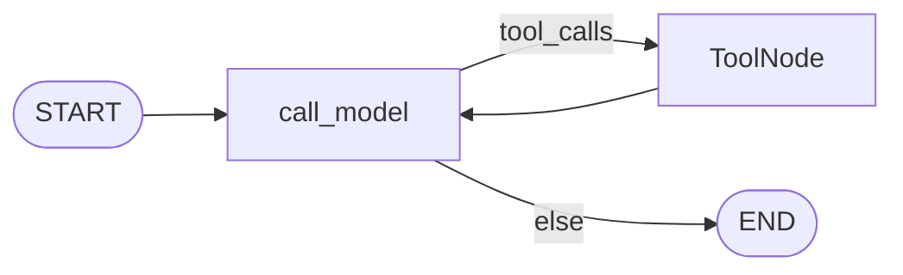
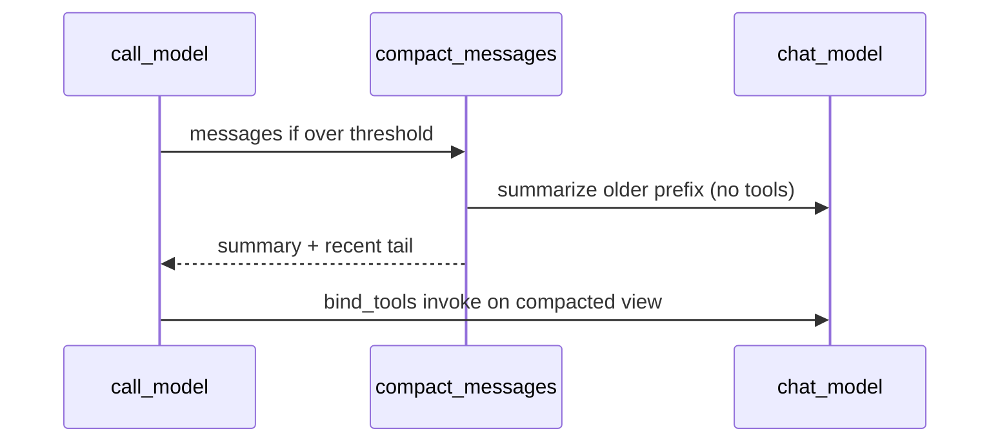

# Milestone 7: Context compaction

## Status

Planned

## Goal

When a session’s message list grows past a **token (or char-estimate) threshold**, automatically **summarize older turns** and keep only a short recent tail — so long `thread_id` sessions stay inside the model context window without wiping the checkpointer or forcing the user to start a new thread.

## Why this milestone (learning objectives)

- M5 made sessions durable; durability without compaction means **context grows without bound** → eventually hit provider limits, pay more, or degrade quality (models attend poorly to huge histories).
- Claude Code–style agents do not keep every tool dump forever in the active prompt; they **compact**. This is different from M8 long-term memory (facts in DB/graph): compaction is **lossy compression of the live transcript**.
- Architecture Option B put compaction in the **policy / extension plane** (before `call_model`), not as a pile of new ReAct edges — learn that split.

### Why bother — with vs without compaction

| Concern | Without compaction | With compaction |
|---|---|---|
| Long `thread_id` sessions | Context hits max tokens / errors / silent truncation | Bounded prompt size; session can continue |
| Cost / latency | Every turn resends full history | Older turns replaced by one summary |
| Quality | Noise from ancient tool payloads distracts the model | Recent turns stay verbatim; gist of the past remains |
| Checkpointer | Still stores full history (good for audit) vs what the model *sees* | Teaching point: **stored state ≠ prompt view** (simplification: we may rewrite `messages` in state — label clearly) |

**Necessity:** not required for short demos; **required** once multi-turn coding sessions are the product. Without M7, M5’s durable threads are a footgun.

## Concepts introduced

- **Context window:** hard limit on tokens the model can consume per call.
- **Compaction / summarization:** replace a prefix of messages with a shorter summary message; keep a **recent window** verbatim.
- **Token estimate (simplification):** char-count / 4 (or similar) instead of provider-accurate tiktoken — label as approximate.
- **Stored vs sent (teaching tension):** production often keeps full checkpoints and builds a *view* for the model; we may **simplify** by rewriting `messages` in graph state after compact so the next `call_model` sees the compacted list (call this out as a simplification vs audit-perfect history).

## Design decisions & alternatives considered

| Decision | Choice | Alternatives rejected |
|---|---|---|
| Where it runs | Helper invoked at the start of `call_model` (policy plane), topology stays `call_model` ↔ `tools` | New `compact` node always in the path (extra hop; OK as optional dig if we want `updates` visibility) |
| Trigger | Estimated tokens (or chars) over `CONTEXT_COMPACT_THRESHOLD` | Compact every N turns only (less precise) |
| What to keep | Last `CONTEXT_KEEP_RECENT` messages + one summary of the older prefix | Drop oldest with no summary (loses goals/decisions) |
| Summarizer | Same chat model, no tools, short system prompt (“summarize for a coding agent…”) | Dedicated small model (later optional dig) |
| Tool-call integrity | When slicing the prefix, avoid orphaning `ToolMessage`s without their `AIMessage(tool_calls)` (drop or extend boundary to a safe cut) | Blind slice by count (breaks providers) |
| Checkpointer | Compacted messages become the new state the checkpointer saves going forward (**simplification**) | Shadow full history in a parallel channel (production-grade; defer) |

**Simplification:** approximate tokens; same model for summary; rewrite live `messages` rather than dual-store transcript + view.

## Architecture graph (planned)





Topology of nodes/edges **unchanged**; compaction is a pre-invoke step inside (or immediately before) `call_model`.

## Testing (planned)

### Unit

- [ ] Below threshold: messages unchanged; summarizer LLM not called
- [ ] Above threshold: prefix replaced by one summary-bearing message; recent tail preserved; estimated size drops
- [ ] Safe cut: does not leave a lone `ToolMessage` without its parent tool-call AI message
- [ ] Fake summarizer records prompt content (proves older turns were passed to summarize)

### Integration

- [ ] Live provider: force low threshold + long synthetic/replayed history → next turn still completes (skip if provider down)
- [ ] Optional: same `thread_id` + Postgres: after compact, resumed turn uses compacted messages (skip if Postgres down)

## Tasks

- [ ] `agent/compact.py` (or similar): estimate size, safe slice, summarize, return new message list
- [ ] Settings: `CONTEXT_COMPACT_THRESHOLD`, `CONTEXT_KEEP_RECENT` (+ `.env.example`)
- [ ] Wire into `call_model` before `bound.invoke`
- [ ] Unit + integration tests
- [ ] Results + LEARNING_LOG + architecture; commit + push

## Demo / acceptance criteria

1. With a tiny threshold in `.env`, a multi-turn `--thread-id` / `--repl` session triggers compaction (visible via log line or CLI note **simplification:** e.g. stderr `compacted messages N→M`).
2. After compaction, the agent still answers using facts that only appeared in early turns *if* the summary captured them (model-dependent; tests assert structure, demo asserts best-effort recall).
3. Unit tests green offline; integration skips cleanly without provider/Postgres.
4. Docs state stored-history simplification vs production dual-store.

## Results

*(Fill after implementation.)*

### What we did

### Commands & how to reproduce

### As-built graph

```mermaid
%% fill after implementation
```

- Delta vs planned graph:

### Why this approach

### Deviations from plan

### Pitfalls & aha moments

### Testing results

### Open questions / next dig
