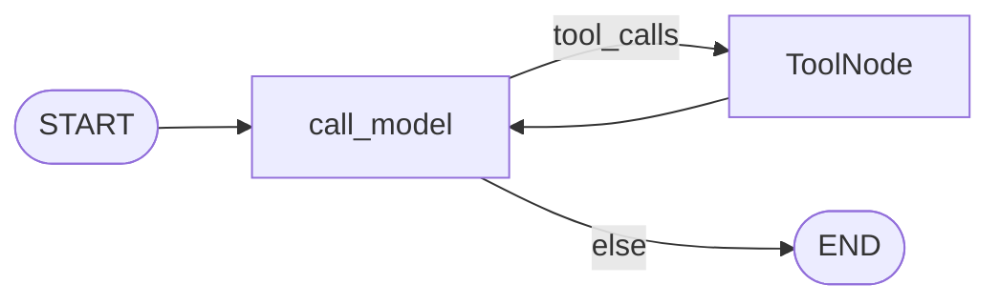
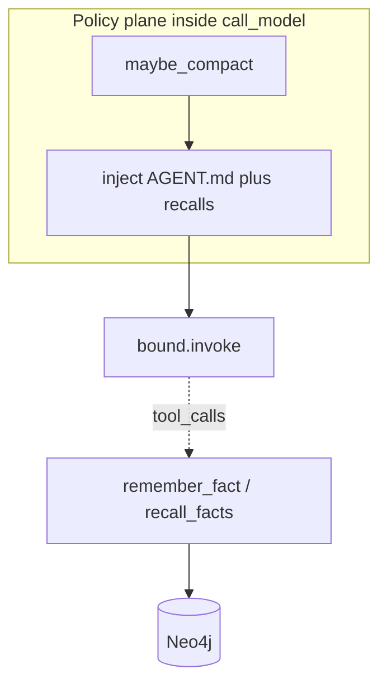

# Milestone 8: Project + long-term memory

## Status

Planned

## Goal

Give the agent **memory that survives compaction and new threads**: (1) inject project instructions from an `AGENT.md`-style file every turn; (2) persist/recall durable facts in **Neo4j**; (3) document clearly **when files vs graph vs vectors win** — with pgvector left as a thin/optional path so M0’s Postgres extension finally has a teaching story without boiling the ocean into full RAG.

## Why this milestone (learning objectives)

- M7 compaction **throws away transcript detail on purpose**. Facts the user cares about (“prefer pnpm”, “API lives in `backend/src`”) must live **outside** the message list.
- Claude Code–style agents always load **project guidance** (CLAUDE.md / AGENT.md) into context — that is *project* memory, not chat history.
- M0 already runs Neo4j + pgvector idle; M8 is when **provision meets use**, and when you learn *which store fits which shape of memory*.

### Why bother — with vs without long-term memory

| Concern | Without M8 | With M8 |
|---|---|---|
| After compaction | Goals/preferences may vanish from the summary | Durable facts still recallable |
| New `thread_id` | Blank slate every session | Same `AGENT.md` + Neo4j facts still apply |
| Only checkpointer | Remembers *this* thread’s transcript | Remembers *project-level* knowledge across threads |
| Wrong store | Stuff everything in chat or one giant markdown | Match shape: instructions → file; relations → graph; fuzzy retrieval → vectors |

**Necessity:** optional for one-shot demos; **required** for a coding agent that feels project-aware across days.

## Concepts introduced

- **Project memory (`AGENT.md`):** human-editable instructions injected every turn (policy plane), similar to Claude Code’s project docs.
- **Episodic vs semantic (light touch):** checkpointer/transcript ≈ what happened in this thread; Neo4j/facts ≈ stable beliefs about the project.
- **Graph memory:** entities + relationships (or simple `Fact` nodes) queried structurally — “what depends on X?”
- **Vector memory (pgvector):** embedding similarity for fuzzy recall — “stuff about auth” without exact keywords.
- **Memory inject:** prepend retrieved/project text before `bind_tools` invoke (Option B plane), topology unchanged.

### When files vs graph vs vectors win (teaching table)

| Store | Best for | Weak at |
|---|---|---|
| **File (`AGENT.md`)** | Stable project norms, commands, layout the human wants always on | Large/changing fact sets; multi-hop relations |
| **Graph (Neo4j)** | Explicit relations, entitlements, “A uses B”, structured recall | Fuzzy natural-language search without a schema |
| **Vectors (pgvector)** | Semantic / fuzzy retrieval over notes & docs | Precise joins; “always inject this paragraph” |

**M8 implementation bias:** ship **file inject + Neo4j facts** fully; for vectors, either a **minimal** embed+query slice **or** a documented stub + “next dig” — choose in Tasks below and freeze at approval.

## Design decisions & alternatives considered

| Decision | Choice | Alternatives rejected |
|---|---|---|
| Project file | `workspace/AGENT.md` (jail-friendly; create template if missing) | Only repo-root `AGENT.md` outside workspace (tools can’t edit it under jail) |
| Inject where | Start of `call_model` (with compaction order: **compact → inject memory → invoke**) | Extra graph node `memory` (unnecessary topology noise) |
| Long-term store | Neo4j facts via tools `remember_fact` / `recall_facts` (and/or auto-inject top-N on turn start) | Only markdown append (no structured recall) |
| Vectors in M8 | **Preferred:** minimal pgvector table + one embed path (Ollama embeddings if available) **or** skip code and document only — **decide at approval** | Full RAG pipeline, chunking UI, hybrid ranker |
| Write path | Model calls `remember_fact` when user states a durable preference | Silent auto-extract every turn (noisy; later dig) |
| vs M7 | Compaction may drop chat detail; Neo4j/`AGENT.md` are the escape hatches | Re-inject full transcript after compact |

**Simplification:** no multi-tenant ACL; no fancy entity resolution; fact schema stays small; vector path may be minimal or deferred one dig.

### Proposed compact → memory → model order

```text
messages
  → maybe_compact (M7)
  → inject AGENT.md (+ optional recalled facts)
  → bound.invoke(...)
```

## Architecture graph (planned)





Topology of ReAct nodes/edges **unchanged**; memory is inject + tools.

## Testing (planned)

### Unit

- [ ] `AGENT.md` present → system/project message appears in the list passed to the model (fake LLM records messages); missing file → template or skip without crash
- [ ] `remember_fact` / `recall_facts` pure helpers (or tools with fake Neo4j driver) round-trip a fact
- [ ] Inject order: compaction can rewrite messages; inject still prepends project memory on the compacted view
- [ ] If vectors in scope: embed+query helper with fake embedding function returns nearest neighbor

### Integration

- [ ] Live Neo4j: remember then recall across a new graph invoke / thread (skip if Neo4j down)
- [ ] Live agent turn: prompt that should use `AGENT.md` content (skip if provider down)
- [ ] If vectors in scope: write + similarity query against Compose Postgres pgvector (skip if down / no embed model)

## Tasks

- [ ] Add `workspace/AGENT.md` template + loader/injector
- [ ] Neo4j fact store module + `remember_fact` / `recall_facts` tools wired into default toolset
- [ ] Wire inject into `call_model` after compact, before invoke
- [ ] **Approval choice:** minimal pgvector path **or** docs-only vectors this milestone
- [ ] Unit + integration tests; `db-inspect` may show Neo4j non-empty after demos
- [ ] Results + LEARNING_LOG + architecture; commit + push

## Demo / acceptance criteria

1. Edit `workspace/AGENT.md` with a distinctive rule; agent’s next reply/behavior reflects it (model-dependent but inject must be visible in tests).
2. Ask the agent to remember a fact; new `--thread-id` can `recall_facts` / answer using Neo4j (skip OK if Neo4j down in CI).
3. Docs include the files vs graph vs vectors table; implementation matches the approved vector scope.
4. Unit tests green offline; integration skips cleanly without services/keys.

## Open decision for approval

Reply with preference (default if silent: **A**):

- **A.** Neo4j + `AGENT.md` in code; vectors = documentation + “why pgvector exists” only this milestone  
- **B.** Also ship a **minimal** pgvector remember/recall (one table, one embedding call)

## Results

*(Fill after implementation.)*

### What we did

### Commands & how to reproduce

### As-built graph

```mermaid
%% fill after implementation
```

- Delta vs planned graph:

### Why this approach

### Deviations from plan

### Pitfalls & aha moments

### Testing results

### Open questions / next dig
