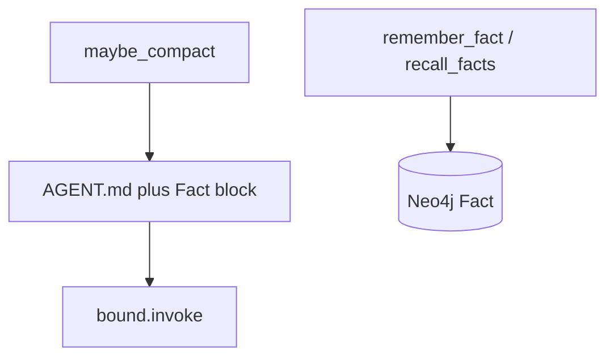

# Milestone 8: Project + long-term memory

## Status

Done

## Goal

Give the agent **memory that survives compaction and new threads**: (1) inject project instructions from an `AGENT.md`-style file every turn; (2) persist/recall durable facts in **Neo4j**; (3) document clearly **when files vs graph vs vectors win** — with pgvector left as a thin/optional path so M0’s Postgres extension finally has a teaching story without boiling the ocean into full RAG.

## Why this milestone (learning objectives)

- M7 compaction **throws away transcript detail on purpose**. Facts the user cares about (“prefer pnpm”, “API lives in `backend/src`”) must live **outside** the message list.
- Claude Code–style agents always load **project guidance** (CLAUDE.md / AGENT.md) into context — that is *project* memory, not chat history.
- M0 already runs Neo4j + pgvector idle; M8 is when **provision meets use**, and when you learn *which store fits which shape of memory*.

### Important: Postgres already stores the conversation

| Layer | Where (in this repo) | What it stores | Milestone |
|---|---|---|---|
| **Session transcript** | Postgres via LangGraph **checkpointer** | Full/compacted `messages` for a `thread_id` | **M5** (already done) |
| **Project instructions** | File `workspace/AGENT.md` | Human-edited norms always injected | **M8** |
| **Durable structured facts** | **Neo4j** (not a second copy of chat) | Stable beliefs / relations across threads | **M8** |
| **Semantic / fuzzy recall** | **pgvector** on the same Postgres | Embeddings for “find notes like this question” | M8 optional / later |

So we are **not** choosing Neo4j *instead of* saving dialogue in PostgreSQL. Dialogue → checkpointer (Postgres). Neo4j is for **long-term knowledge that is not “the chat log”**.

### What “vector scope” means (approval A vs B)

**Vectors** = store text as **embedding numbers** in pgvector, then retrieve by **similarity**.

- **A.** Neo4j + `AGENT.md` only (initial land)  
- **B. (implemented as follow-on)** Also ship a **minimal** pgvector remember/recall (one table, one embedding call)


### Why bother — with vs without long-term memory

| Concern | Without M8 | With M8 |
|---|---|---|
| After compaction | Goals/preferences may vanish from the summary | Durable facts still recallable |
| New `thread_id` | Blank slate every session | Same `AGENT.md` + Neo4j facts still apply |
| Only checkpointer | Remembers *this* thread’s transcript | Remembers *project-level* knowledge across threads |
| Wrong store | Stuff everything in chat or one giant markdown | Match shape: instructions → file; relations → graph; fuzzy retrieval → vectors |

## Concepts introduced

- **Project memory (`AGENT.md`):** human-editable instructions injected every turn (policy plane).
- **Graph memory:** `Fact` nodes in Neo4j; tools `remember_fact` / `recall_facts`.
- **Memory inject:** prepend project (+ best-effort fact block) after compact, before invoke.
- **Vector memory:** documented only in M8 (pgvector reserved for M20+).

### When files vs graph vs vectors win

| Store | Best for | Weak at |
|---|---|---|
| **File (`AGENT.md`)** | Stable project norms always on | Large/changing fact sets; multi-hop relations |
| **Graph (Neo4j)** | Explicit facts / later relations | Fuzzy natural-language search without embeddings |
| **Vectors (pgvector)** | Semantic / fuzzy retrieval | Precise joins; “always inject this paragraph” |

## Design decisions & alternatives considered

| Decision | Choice | Alternatives rejected |
|---|---|---|
| Project file | `workspace/AGENT.md` (jail-friendly) | Only repo-root outside workspace |
| Inject where | After compact, before invoke inside `call_model` | Extra graph node |
| Long-term store | Neo4j `Fact` + tools | Markdown-only append |
| Vectors in M8 | **A** — docs only | Full RAG |
| Write path | Model calls `remember_fact` | Silent auto-extract every turn |

## Architecture graph (planned)


## Testing (planned)

### Unit

- [x] `AGENT.md` inject visible to fake LLM
- [x] Idempotent inject; template ensure
- [x] Fact prompt formatter

### Integration

- [x] Live Neo4j remember/recall round-trip (skip if down)

## Tasks

- [x] `workspace/AGENT.md` + loader/injector
- [x] Neo4j fact store + tools in default toolset
- [x] Wire inject into `call_model`
- [x] Vector scope **A**
- [x] Unit + integration tests
- [x] Results + LEARNING_LOG + architecture; commit + push

## Demo / acceptance criteria

1. Edit `workspace/AGENT.md`; next agent turn sees it in the model prompt (unit proves inject).
2. `remember_fact` then `recall_facts` / new thread (integration + `./scripts/db-inspect.sh neo4j`).
3. Docs include files vs graph vs vectors; vectors not coded this milestone.
4. Unit green; integration skips cleanly without Neo4j.

## Parked for later (not M8)

- **M20** — ingestion chunking → Neo4j/pgvector  
- **M21** — local Elasticsearch  

## Results

### What we did

- `agent/project_memory.py`: load/ensure/inject `AGENT.md`.
- `memory/neo4j_facts.py` + `tools/memory_tools.py`: `remember_fact` / `recall_facts`.
- `call_model`: compact → inject AGENT.md + best-effort Neo4j fact block → invoke.
- Default toolset includes memory tools; `neo4j` moved to main deps; `db-inspect` shows Fact nodes.
- Vector path: **B** — `memory/pgvector_notes.py` + tools `remember_note` / `recall_notes` (Ollama embeddings; `ollama pull nomic-embed-text`).

### Commands & how to reproduce

```bash
./scripts/test.sh tests/unit/test_m8_memory.py -v
./scripts/test.sh tests/integration/test_m8_memory_live.py -v
./scripts/test.sh tests/integration/test_m8_pgvector_live.py -v
# Optional: ollama pull nomic-embed-text
./scripts/db-inspect.sh neo4j
./scripts/db-inspect.sh postgres

# Edit workspace/AGENT.md then:
./scripts/agent.sh --thread-id mem-demo "What project rules should you follow?"
# Ask to remember a fact, then new thread:
./scripts/agent.sh --thread-id mem-demo-2 "Recall durable facts about package managers."
```

### As-built graph




- Delta: topology unchanged; memory is inject + tools.

### Why this approach

- Separates transcript (Postgres checkpointer), project norms (file), and durable facts (Neo4j).
- Keeps Option B policy plane; no god-object graph.

### Deviations from plan

- Approval followed by **B**: minimal pgvector notes path added.
- Auto-inject of recent Neo4j facts is best-effort (empty if Neo4j down) in addition to explicit `recall_facts` tool.

### Pitfalls & aha moments

- Inject must be idempotent across tool-loop iterations or SystemMessages stack.
- `workspace/*` gitignore needed `!workspace/AGENT.md` exception.

### Testing results

- Unit: `test_m8_memory.py` + `test_m8_pgvector.py`.
- Integration: Neo4j round-trip; pgvector SQL round-trip with fake embedder; live Ollama embed test skips until `ollama pull nomic-embed-text`.

### Open questions / next dig

- M20 / M21: ingestion + Elasticsearch.
- Optional dig: richer Neo4j relationships beyond flat `Fact` nodes.
