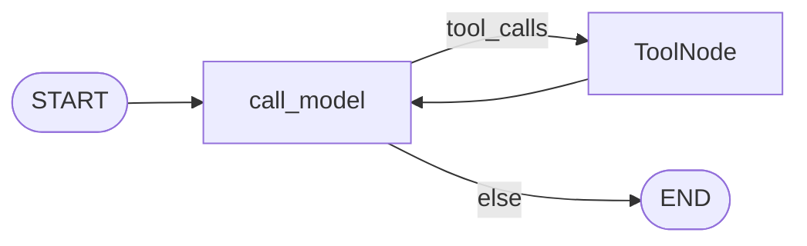
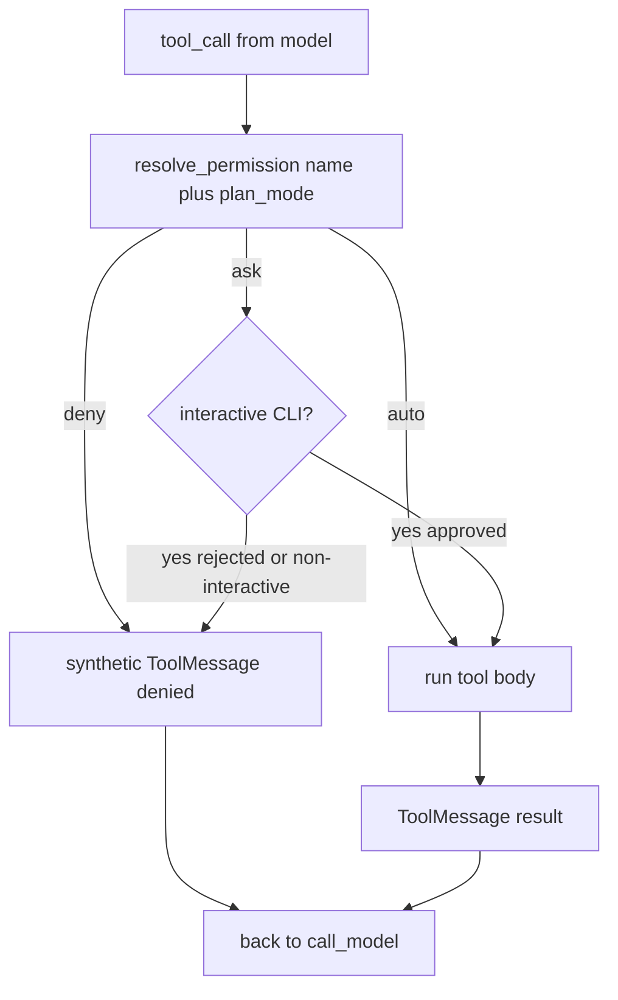

# Milestone 9: Permissions & Plan Mode

## Status

Done

## Goal

Add a **policy plane** for tools: per-tool `auto` / `ask` / `deny`, plus a **Plan Mode** that forces read-only execution — without turning the ReAct graph into a permissions god-object, and without implementing LangGraph `interrupt` yet (that is **M10**).

## Why this milestone (learning objectives)

- M3–M8 gave the agent real power (FS write, shell, git, memory writes). Without a permission layer, every tool_call is **auto-approve** — fine for a toy, unsafe for anything Claude Code–like.
- **Permissions** answer: *is this tool allowed under current policy?* **HITL interrupt (M10)** answers: *how do we pause the graph and resume after a human decides?* Mixing them early hides both lessons.
- **Plan Mode** is the teaching twin of “read-only session”: the model can still reason and use read tools; mutating side effects are blocked by policy, not by hoping the model behaves.
- Industry parallel: Claude Code / Cursor-style agents keep a small cognition loop and attach **allow/ask/deny** as policy around tool execution.

### With vs without

| Concern | Without M9 | With M9 |
|---|---|---|
| `write_file` / `run_shell` | Always runs | Policy: auto, ask (CLI), or deny |
| “Just explore, don’t change anything” | Prompt-only hope | `--plan` / Plan Mode → mutators denied |
| Later Slack/PR ship (M18/M19) | No deny-by-default story | Policy table is the hook; M10 adds durable pause |
| Graph topology | Tempted to add Approve nodes everywhere | Still `call_model` ↔ `tools`; policy wraps execution |

## Concepts introduced

- **Permission mode (per tool):** `auto` | `ask` | `deny`.
- **Plan Mode:** session/run flag that overrides the effective policy so **mutating** tools are `deny` (read tools stay `auto`).
- **Policy plane (Option B):** resolve decision *before* the tool body runs; return a synthetic denial string on deny (and on ask-rejected) so the ReAct loop continues.
- **Ask without interrupt (M9 simplification):** CLI can block on stdin (`y/n`) for `ask`. This does **not** survive process death or remote adapters — M10 replaces it with `interrupt` + checkpointer resume.
- **Mutating vs read-safe:** classification of the default toolset so Plan Mode and defaults are reviewable in one table.

### Default tool classification (as-built)

| Class | Tools (current default set) | Default mode (normal) | In Plan Mode |
|---|---|---|---|
| Read-safe | `read_file`, `glob_files`, `grep_files`, `git_status`, `git_diff`, `git_log`, `recall_facts`, `recall_notes` (+ demo `add`) | `auto` | `auto` |
| Mutating FS/VCS | `write_file`, `edit_file`, `git_commit` | `ask` | `deny` |
| Dangerous host | `run_shell` | `ask` | `deny` |
| Memory writes | `remember_fact`, `remember_note` | `ask` | `deny` |

**Simplification:** one global default table + env/CLI Plan Mode; no per-workspace JSON ACL / sticky “always allow” yet (product rules on top of this plane — see Learning Log dig).

## Design decisions & alternatives considered

| Decision | Choice | Alternatives rejected |
|---|---|---|
| Where to enforce | `apply_permissions` wraps each `BaseTool` before `ToolNode` | New graph nodes per permission; hope system prompt alone |
| Plan Mode effect | Override effective mode of mutators → `deny` | Strip mutators from `bind_tools` only |
| Ask in M9 | CLI stdin callback when TTY; non-interactive → deny | Full LangGraph `interrupt` (reserved for **M10**) |
| Config surface | `AGENT_PLAN_MODE` / `--plan` | Huge YAML permission product in one milestone |
| Topology | Unchanged ReAct | Approve/Reject StateGraph branches |

## Architecture graph (planned)

ReAct topology **unchanged**. Policy sits on the tool execution path:





## Testing (planned)

### Unit (no network)

- [x] `resolve_permission` / defaults for read vs mutating
- [x] Plan Mode forces mutators to `deny`
- [x] Denied tool does not call body
- [x] Ask approve / reject / no callback
- [x] ToolNode + graph with fake LLM under Plan Mode

### Integration

- [x] Plan Mode + `read_file` still works (fake LLM under integration marker)
- [x] Live Ollama Plan Mode write deny (skip unless `MCC_LIVE_LLM=1`)

## Tasks

- [x] `agent/permissions.py`
- [x] Wrap tools in `build_agent_graph`
- [x] CLI `--plan` + TTY ask callback
- [x] Settings / `.env.example` `AGENT_PLAN_MODE`
- [x] Unit + integration tests
- [x] Results + LEARNING_LOG + architecture; commit + push

## Demo / acceptance criteria

1. Normal mode: `read_file` runs without prompting; `write_file` / `run_shell` prompts on TTY (or denies if non-interactive).
2. `--plan`: mutating tools never execute; denial message visible; reads still work.
3. Graph node list still `call_model` + `tools` only.
4. Unit tests green; integration cases present.
5. Docs: **ask via stdin is a simplification; M10 = interrupt.**

## Results

### What we did

- Added `agent/permissions.py`: classification tables, `resolve_permission`, `apply_permissions` wrappers, `make_cli_ask_callback`.
- `build_agent_graph(..., plan_mode=, ask_callback=)` wraps tools before `ToolNode` / `bind_tools`.
- CLI: `--plan` and `AGENT_PLAN_MODE`; TTY ask; non-TTY ask → deny.
- Tests: `tests/unit/test_m9_permissions.py`, `tests/integration/test_m9_permissions_live.py`.

### Commands & how to reproduce

```bash
./scripts/test.sh tests/unit/test_m9_permissions.py -v
./scripts/test.sh tests/integration/test_m9_permissions_live.py -v
# Plan Mode (mutating denied):
./scripts/agent.sh --plan --no-stream "Use write_file to create x.txt with hi"
# Normal TTY: write_file / run_shell should prompt y/N
./scripts/agent.sh --repl
```

### As-built graph + delta

Topology **unchanged** vs M8 (`call_model` ↔ `tools`). Delta is policy wrap on the tool list only (see architecture policy diagram above).

### Why this approach

Option B: keep cognition loop small; put allow/ask/deny in the policy plane so M10 interrupt and later channel adapters share one decision function.

### Deviations

- Tool names in classification use as-built names (`glob_files` / `grep_files`; no separate `git_add` — staging is inside `git_commit`).
- Unknown tools: `ask` normally; `deny` in Plan Mode (cautious).

### Pitfalls

- Without an ask callback (CI, pipes), mutating tools **deny** by default — intentional for non-interactive safety; use an explicit approve callback in tests that need writes through the graph.
- Wrapping recreates `StructuredTool`s; schemas must be preserved for `bind_tools`.

### Testing results

- Unit: 8 passed (`test_m9_permissions.py`).
- Integration: 1 passed, 1 skipped without `MCC_LIVE_LLM`.

### Open questions / next dig

- **M10:** replace CLI ask with LangGraph `interrupt` + resume on same `thread_id`.
- Later: path ACL / sticky grants (product layer on this plane).
